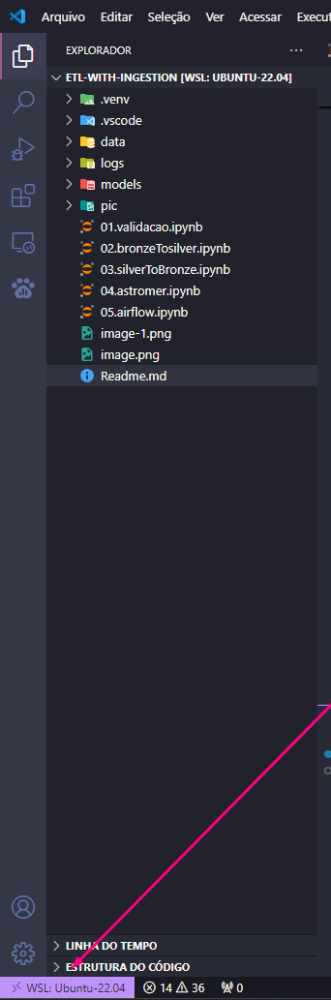
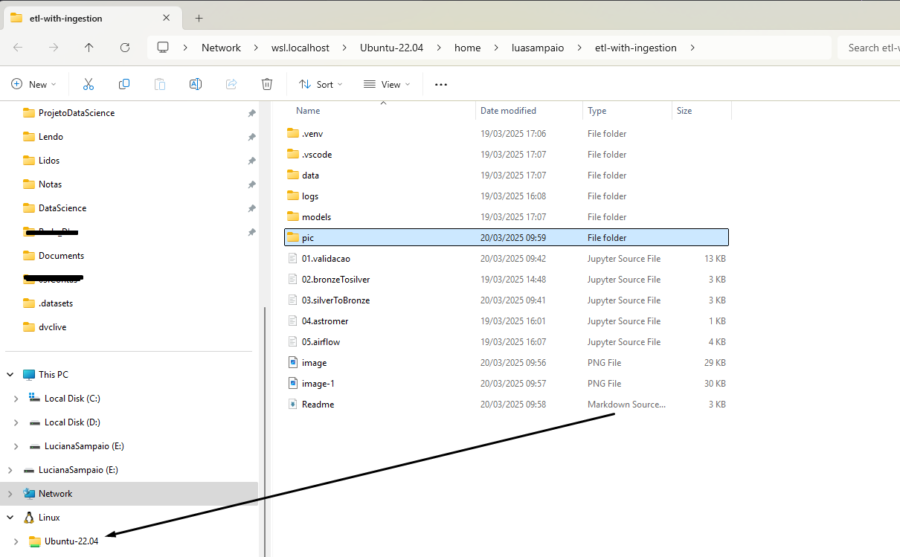

## POC - ETL usando WSL2 no windows. 

- Data Criação: 19/03/25
- Por: Luciana Sampaio 


- Objetivo: 
    - Realizar instalar e executar o Projeto usando wsl2 no windows 11


 


> Local  armazenado no windows 


 


#### Passo 1: Criação do Ambiente de Desenvolvimento

1. **Criar uma Pasta para o Projeto:**
   - Crie uma nova pasta para o seu projeto, por exemplo: `backup_s3`.

2. **Criar um Ambiente Virtual (Opcional, mas Recomendado):**
   - Navegue até a pasta do projeto e crie um ambiente virtual:
   
   ```bash
   python -m venv venv
   ```

   - Ative o ambiente virtual:
     - **Windows:** `venv\Scripts\activate`
     - **Linux/MacOS:** `source venv/bin/activate`

3. **Instalar Dependências Necessárias:**
   - Instale o boto3 para interagir com o S3 e outras bibliotecas necessárias:
   
   ```bash
   pip install boto3
   ```


# WSL

---

### **1. Baixar e instalar a extensão WSL no VS Code**
1. Abra o **Visual Studio Code** no Windows.
2. Vá para a aba de **Extensões** (ou use `Ctrl+Shift+X`).
3. Na barra de pesquisa, digite:  
   ```
   Remote - WSL
   ```
4. Clique em **"Install"** para instalar a extensão **Remote - WSL**.
5. Após a instalação, reinicie o VS Code, se necessário.

---

### **2. Criar uma pasta chamada "projetos" na `home` usando o WSL**

1. Abra o **WSL** (pesquise "WSL" ou "Ubuntu" no menu Iniciar).
2. No terminal, digite:
   ```bash
   cd ~
   mkdir projetos
   cd projetos
   ```
3. Verifique se a pasta foi criada com:
   ```bash
   ls
   ```
   - O comando deve mostrar a pasta "projetos".

---

### **3. Acessar a pasta usando o Git Bash**

1. Abra o **Git Bash** no Windows.
2. Navegue até a pasta "projetos" com:
   ```bash
   cd //wsl$/Ubuntu/home/projetos/
   ```
3. Digite:
   ```bash
   ls
   ```
   - Se tudo estiver correto, você verá a pasta "projetos".

---

### **4. Acessar a pasta "projetos" pelo Explorador de Arquivos do Windows**

1. Abra o **Explorador de Arquivos**.
2. Na barra de endereços, digite:
   ```
   \\wsl$\Ubuntu\home\projetos\
   ```
3. Pressione **Enter**.  
   Agora você pode ver e gerenciar os arquivos dentro dessa pasta diretamente pelo Windows.

---

### **Dica Extra: Abrir a pasta diretamente no VS Code**

1. No terminal do **WSL**, navegue até a pasta:
   ```bash
   cd ~/projetos
   ```
2. Abra a pasta no VS Code com:
   ```bash
   code .
   ```
   - Isso abrirá o VS Code diretamente com a pasta "projetos" como seu workspace.

---

Segue meus contatos no que precisar. 

 🌐 [LinkedIn](https://www.linkedin.com/in/luciana-sampaio/)  
  *O lugar onde pareço super profissional e séria. 😉*

 🐙 [GitHub](https://github.com/luasampaio)  
  *Aqui é o cantinho dos meus códigos! Dá uma espiada, mas cuidado com os bugs. 😂*

 📸 [Instagram](https://www.instagram.com/luasampaio/)  
  *Spoiler: mais fotos e menos linhas de código! 📷✨*
